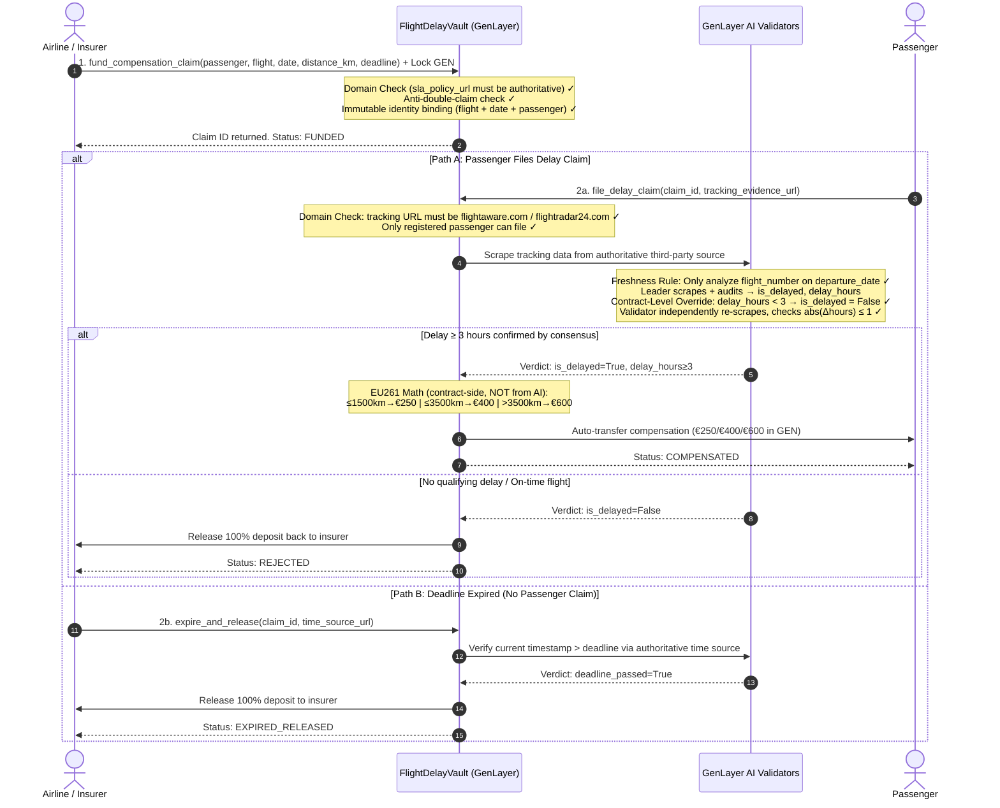

# FlightDelayVault // Autonomous EU261 Flight Delay Compensation Escrow

[](https://genlayer.com)
[](https://github.com/Tannpd/FlightDelayVault)
[](LICENSE)

---

## 📌 Problem Statement

Under **EU Regulation 261/2004** and **US DOT regulations**, airline passengers are entitled to automatic compensation of **€250–€600** when flights are delayed ≥ 3 hours or cancelled. In practice, airlines impose months-long manual claim processes, requiring passengers to submit paper forms, wait for airline discretion, and accept frequent denials based on manufactured "extraordinary circumstances" excuses.

**FlightDelayVault** eliminates the intermediary entirely. Airlines or travel insurers lock EU261 compensation funds into a GenLayer vault. When a qualifying delay is confirmed by **independent AI Validators scraping authoritative third-party tracking sources** (FlightAware, Flightradar24), compensation is atomically released to the passenger wallet — no forms, no wait, no human discretion.

> **Why GenLayer is irreplaceable here**: No centralized system can perform trust-minimized, multi-party verification of live flight data and execute atomic on-chain settlement simultaneously. Without GenLayer's AI consensus layer, this either requires a trusted oracle (centralized risk) or is simply impossible.

---

## 🏛️ Architecture & Compensation Flow



---

## 🛡️ Security & Validation Design (Staff-Proof)

| Threat Vector | Attack Scenario | FlightDelayVault Defense |
|---|---|---|
| **Airline-controlled evidence** | Airline submits its own status page URL claiming "on time" | **Authoritative Third-Party Domain Allowlist**: `file_delay_claim` only accepts `flightaware.com`, `flightradar24.com` — airline-hosted URLs are rejected |
| **Stale / recycled incident data** | Passenger submits old 2024 delay log for a 2026 flight | **Departure Date Binding + Freshness Rule**: `departure_date` stored immutably; AI prompt explicitly filters to only analyze data for `{flight_number}` on `{departure_date}` |
| **AI-inflated compensation** | AI returns `refund_percentage=100` for 2h delay | **Contract-Level EU261 Math Override**: (1) `delay_hours < 3 → is_delayed = False` hard-coded in contract; (2) Compensation = `f(distance_km)` computed by contract, never from AI output |
| **Validator schema-only check** | Validator only checks JSON keys, not delay content | **Semantic Delay Tolerance**: Validator independently re-scrapes, verifies `abs(leader_hours - val_hours) ≤ 1` AND `leader_delayed == val_delayed` |
| **Double-claim fraud** | Same passenger claims twice for same flight | **Anti-Double-Claim Registry**: `used_claims[flight+date+passenger]` key permanently set at creation |
| **Permanently locked funds** | Passenger lost wallet access; insurer funds stuck forever | **Deadline Recovery Path**: `expire_and_release()` with AI-verified time consensus allows insurer to reclaim after deadline |
| **String boolean coercion** | AI returns `"true"` string instead of `true` boolean | **Strict `isinstance(is_delayed, bool)` validation** → FAILED status, funds preserved |
| **Zero-value deposit** | Insurer creates vault with 0 GEN | **Deposit > 0 guard** at `fund_compensation_claim` |

---

## ⚙️ EU261 Compensation Tiers (Contract-Level Math)

| Flight Distance | Compensation | Minimum Delay |
|---|---|---|
| ≤ 1,500 km | **€250** (250 GEN) | ≥ 3 hours |
| 1,500 – 3,500 km | **€400** (400 GEN) | ≥ 3 hours |
| > 3,500 km | **€600** (600 GEN) | ≥ 3 hours |

**Protocol**: 1 GEN = 1 € for this contract. Compensation amounts are computed entirely by `_eu261_compensation_units(distance_km)` in contract code — **not from AI verdict**.

---

## ⚙️ Contract API Specification

### `fund_compensation_claim(passenger, flight_number, departure_date, flight_distance_km, claim_deadline_ts) → bigint` (payable)
Lock EU261 compensation funds for a specific passenger + flight. All identity fields are immutable after funding.

### `file_delay_claim(claim_id, tracking_evidence_url) → None`
Passenger files delay claim with authoritative tracking URL. AI Validators scrape and verify. Contract applies EU261 math.

### `expire_and_release(claim_id, time_source_url) → None`
Insurer reclaims funds after deadline if passenger files no claim. Uses AI time consensus.

### `get_claim(claim_id) → str` (view)
Returns full JSON: `{id, passenger, insurer, fund, status, flight_number, departure_date, flight_distance_km, tracking_url, delay_hours, compensation_amount, reasoning, deadline}`

### `get_claims_count() → int` (view)

---

## 🧪 Automated Test Suite (20/20 PASSING)

```bash
python -m unittest discover -s tests -p "test_*.py" -v
```

```text
test_contract_overrides_ai_short_delay ............. ok
test_double_claim_same_flight_rejected ............. ok
test_expire_after_deadline_releases_to_insurer ..... ok
test_expire_before_deadline_blocked ................ ok
test_expire_unauthorized_time_domain_rejected ...... ok
test_failed_scrape_preserves_funds ................. ok
test_fund_compensation_claim_payable ............... ok
test_invalid_departure_date_format_rejected ........ ok
test_long_haul_compensated_600_gen ................. ok
test_medium_haul_compensated_400_gen ............... ok
test_no_delay_rejected_insurer_refunded ............ ok
test_only_insurer_can_expire ....................... ok
test_only_passenger_can_file_claim ................. ok
test_reproducible_compilation ...................... ok
test_short_haul_compensated_250_gen ................ ok
test_strict_boolean_rejects_string_true ............ ok
test_unauthorized_tracking_domain_rejected ......... ok
test_validator_hour_divergence_fails_closed ........ ok
test_validator_verdict_mismatch_fails_closed ....... ok
test_zero_deposit_rejected ......................... ok

Ran 20 tests in 0.010s
OK
```

---

## 🚀 Quick Start

### Contract (Python)
```bash
cd D:\Gen\FlightDelayVault
python -m venv .venv
.venv\Scripts\activate
pip install -r requirements-dev.txt
python -m unittest discover -s tests -p "test_*.py" -v
```

### Frontend (React + Vite)
```bash
cd frontend
npm install
npm run dev
```

---

## 🌐 Deployment

- **GenLayer StudioNet Contract**: [`0xFDb21ba414507D1C0d0C7c0292b8909f8E5bB45C`](https://studio.genlayer.com)
- **Live App**: https://flightdelayguard-app.vercel.app
- **GitHub**: https://github.com/Tannpd/FlightDelayVault
- **License**: MIT
